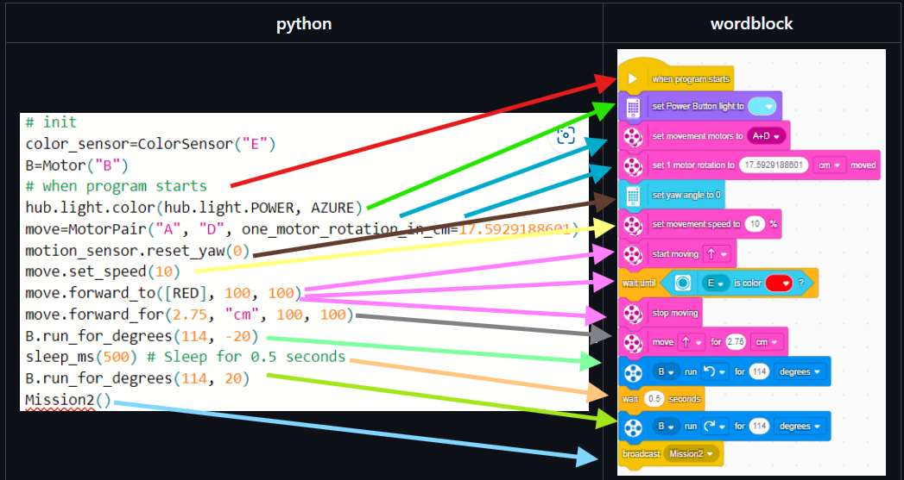

# SPIKE Prime API
## Info
This is a simpler and more intuitive API which runs on SPIKE 3. Just fork this repo and put your main.py in the official lego SPIKE Prime 3 editor. Add your code at the end of the API after the comment. You may remove the comment if you wish.
## Documentation
### Simple example

### Movement
#### General info
If something is all capitalized e.g. "ABCD" it is to be replaced. If something is "?" followed by all capitalized e.g. "?ABCD" it is optional and can be replaced. If two optional arguments are excluded, ", , " is implicitly converted to ", ".
If LEFT_SPEED is changed, LEFT_SPEED's default will be edited. Same with right_speed. If speed is changed, left_speed and right_speed will be changed. The default speed will be 100 if never changed. The default wheel diameter will be 88.
#### Word Block to Python Conversion Table 
| Word Block | Python | Notes
|---|---|---|
|  | ```move.forward_for(ROTATIONS, "rotations", ?LEFT_SPEED, ?RIGHT_SPEED)```|Moves forward for ROTATIONS rotations at LEFT_SPEED speed for the left wheel and RIGHT_SPEED speed for the right wheel
|  | ```move.forward_for(DEGREES, "degrees", ?LEFT_SPEED, ?RIGHT_SPEED)```|Moves forward for DEGREES degrees at LEFT_SPEED speed for the left wheel and RIGHT_SPEED speed for the right wheel
|  | ```move.forward_for(SECONDS, "seconds", ?LEFT_SPEED, ?RIGHT_SPEED)```|Moves forward for SECONDS seconds at LEFT_SPEED speed for the left wheel and RIGHT_SPEED speed for the right wheel
|  | ```move.forward_for(CM, "cm", ?LEFT_SPEED, ?RIGHT_SPEED)```|Moves forward for CM cm at LEFT_SPEED speed for the left wheel and RIGHT_SPEED speed for the right wheel
|  | ```move.forward_for(IN, "in", ?LEFT_SPEED, ?RIGHT_SPEED)```|Moves forward for IN in at LEFT_SPEED speed for the left wheel and RIGHT_SPEED speed for the right wheel
|  | ```move.backward_for(ROTATIONS, "rotations", ?LEFT_SPEED, ?RIGHT_SPEED)```|Moves backward for ROTATIONS rotations at LEFT_SPEED speed for the left wheel and RIGHT_SPEED speed for the right wheel
|  | ```move.backward_for(DEGREES, "degrees", ?LEFT_SPEED, ?RIGHT_SPEED)```|Moves backward for DEGREES degrees at LEFT_SPEED speed for the left wheel and RIGHT_SPEED speed for the right wheel
|  | ```move.backward_for(SECONDS, "seconds", ?LEFT_SPEED, ?RIGHT_SPEED)```|Moves backward for SECONDS seconds at LEFT_SPEED speed for the left wheel and RIGHT_SPEED speed for the right wheel
|  | ```move.backward_for(CM, "cm", ?LEFT_SPEED, ?RIGHT_SPEED)```|Moves backward for CM cm at LEFT_SPEED speed for the left wheel and RIGHT_SPEED speed for the right wheel
|  | ```move.backward_for(IN, "in", ?LEFT_SPEED, ?RIGHT_SPEED)```|Moves backward for IN in at LEFT_SPEED speed for the left wheel and RIGHT_SPEED speed for the right wheel
|  | ```move.forward(?LEFT_SPEED, ?RIGHT_SPEED)```|Moves forward until direction to stop at LEFT_SPEED speed for the left wheel and RIGHT_SPEED speed for the right wheel
|  | ```move.backward(?LEFT_SPEED, ?RIGHT_SPEED)```|Moves backward until direction to stop at LEFT_SPEED speed for the left wheel and RIGHT_SPEED speed for the right wheel
|  | ```move.set_speed(SPEED)```|Sets default speed to SPEED as above in general info
|  | ```move=MotorPair(LEFT_PORT, RIGHT_PORT, ?WHEEL_DIAMETER_MM, ?ONE_MOTOR_ROTATION_IN_CM)```|Sets movement motors. Also needs either WHEEL_DIAMETER_MM or ONE_MOTOR_ROTATION_IN_CM must be passed. Both must not be passed.
|  | ```move.set_motor_rotation(ONE_MOTOR_ROTATION_IN_CM)```|Sets distance moved in cm by one motor rotation.
